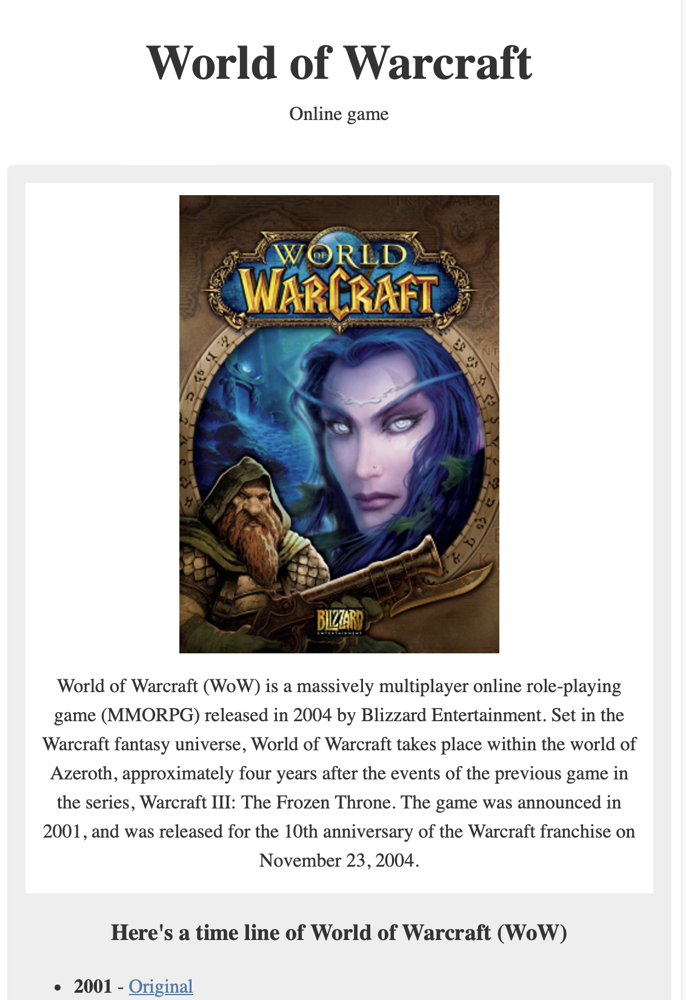

# Responsive Web Design:   \<PJ-02-Tribute Page\>

## Overview

This project focuses on learning the basic structure of HTML and practicing CSS selectors.

## Table of Contents

- [Overview](#overview)
- [Advantages for this project](#advantages-for-this-project)
- [Challenges Encountered](#challenges-encountered)
- [Problem-solving Techniques](#problem-solving-techniques)
- [References](#references)
- [Conclusion](#conclusion)

  

## Advantages for this project

|                     **HTML**                     |         **CSS**          |
| :----------------------------------------------: | :----------------------: |
|                 Basic structure                  |    Selecting targets     |
|                     Heading                      |         Padding          |
|                      Title                       |          Border          |
|                  Meta: charset                   |          Margin          |
|                       Link                       |          Align           |
|                      figure                      | Color / Background-Color |
|                    figcaption                    |          @media          |
|                 Validating input                 |        max-height        |
| Giving attributes  (id, value, for, name ...) |

  

## Challenges Encountered

This was my second HTML and CSS project that required me to write code entirely on my own. While I tried to apply what I had learned and include as much as possible, thankfully, Visual Studio Code's IntelliSense helped me a lot.

One of the main challenges was using CSS to position the image in the center. I tried `display: flex;` and `justify-content: center;`, but I couldn't achieve what I wanted. Then, I searched and revisited previous learning materials, which showed me a very simple solution `margin: auto;` can fix it.

That's why I believe that continuous learning and practice are very important to prevent forgetting what I've learned.

## Problem-solving Techniques

When facing difficulties or confusion, I frequently rely on Google to seek the information I require.

Moreover, when seeking deeper comprehension, I turn to chatGPT, requesting explanations to aid in my self-study journey.

This approach has proven invaluable in helping me navigate complex topics more effectively, considering my current level of understanding.

## References

- [chatGPT](https://chat.openai.com/)
- [freeCodeCamp](https://freecodecamp.org)

## Conclusion

In summary, keeping up with practice is very important, as is continuing to learn.
